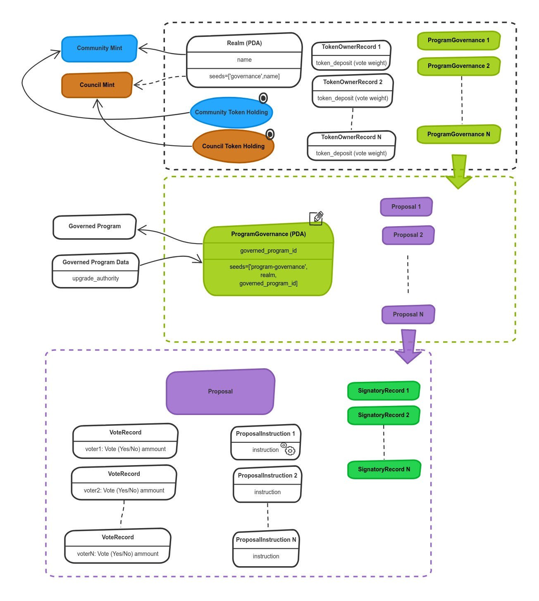
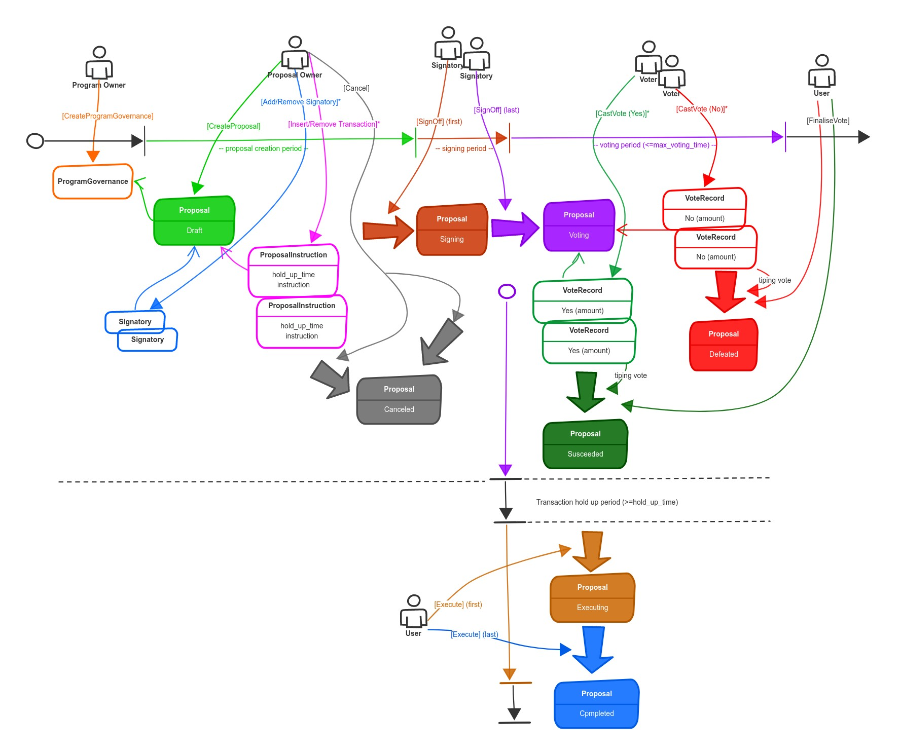

# Governance

Governance is a program the chief purpose of which is to control the upgrade of other programs through democratic means.
It can also be used as an authority provider for mints and other forms of access control as well where we may want
a voting population to vote on disbursement of access or funds collectively.

## Architecture

### Accounts diagram

### Realm account

Realm account ties Community Token Mint and optional Council Token mint to create a realm
for any governance pertaining to the community of the token holders.
For example a trading protocol can issue a governance token and use it to create its governance realm.

Once a realm is created voters can deposit Governing tokens (Community or Council) to the realm and
use the deposited amount as their voting weight to vote on Proposals within that realm.

### Program Governance account

The basic building block of governance to update programs is the ProgramGovernance account.
It ties a governed Program ID and holds configuration options defining governance rules.
The governed Program ID is used as the seed for a [Program Derived Address](https://docs.solana.com/developing/programming-model/calling-between-programs#program-derived-addresses),
and this program derived address is what is used as the address of the Governance account for your Program ID.

What this means is that there can only ever be ONE Governance account for a given Program.
The governance program validates at creation time of the Governance account that the current upgrade authority of the program
taken under governance signed the transaction. Optionally `CreateProgramGovernance` instruction can also transfer `upgrade_authority`
of the governed program to the Governance PDA at the creation time of the Governance account.

### How does the authority work?

Governance can handle arbitrary executions of code, but it's real power lies in the power to upgrade programs.
It does this through executing instructions to the bpf-upgradable-loader program.
Bpf-upgradable-loader allows any signer who has Upgrade authority over a Buffer account and the Program account itself
to upgrade it using its Upgrade command.
Normally, this is the developer who created and deployed the program, and this creation of the Buffer account containing
the new program data and overwriting of the existing Program account's data with it is handled in the background for you
by the Solana program deploy cli command.
However, in order for Governance to be useful, Governance now needs this authority.

### Proposal accounts

A Proposal is an instance of a Governance created to vote on and execute given set of changes.
It is created by someone (Proposal Owner) and tied to a given Governance account
and has a set of executable instructions to it, a name and a description.
It goes through various states (draft, voting, executing, ...) and users can vote on it
if they have relevant Community or Council tokens.
Its rules are determined by the Governance account that it is tied to, and when it executes,
it is only eligible to use the [Program Derived Address](https://docs.solana.com/developing/programming-model/calling-between-programs#program-derived-addresses)
authority given by the Governance account.
So a Proposal for Sushi cannot for instance upgrade the Program for Uniswap.

When a Proposal is created by a user then the user becomes Proposal Owner and receives permission to edit the Proposal.
With this power the Owner can edit the Proposal, add/remove Signatories to the Proposal and also cancel it.
These Signatories can then show their approval of the Proposal by signing it off.
Once all Signatories have signed off the Proposal the Proposal leaves Draft state and enters Voting state.
Voting state lasts as long as the Governance has it configured to last, and during this time
people holding Community (or Council) tokens may vote on the Proposal.
Once the Proposal is "tipped" it either enters the Defeated or Succeeded state. If the vote can't be tipped automatically
during the voting period but still reaches the required Yes vote threshold it can be manually transitioned to Succeeded state
using FinalizeVote instruction.
Once all Proposal instructions are executed the Proposal enters Completed state.

In the Executing state an instruction can be run by any one at any time after the `instruction_hold_up_time` period has
transpired.

### ProposalInstruction

A Proposal can have multiple Proposal Instructions, and they run independently of each other.
These contain the actual data for an instruction, and how long after the voting phase a user must wait before they can
be executed.

### Voting Dynamics

When a Proposal is created and signed by its Signatories voters can start voting on it using their voting weight,
equal to deposited governing tokens into the realm. A vote is tipped once it passes the defined `vote_threshold` of votes
and enters Succeeded or Defeated state. If Succeeded then Proposal instructions can be executed after they hold_up_time passes.

Users can relinquish their vote any time during Proposal lifetime, but once Proposal it decided their vote can't be changed.

### Community and Councils governing tokens

Each Governance Realm that gets created has the option to also have a Council mint.
A council mint is simply a separate mint from the Community mint.
What this means is that users can submit Proposals that have a different voting population from a different mint
that can affect the same program. A practical application of this policy may be to have a very large population control
major version bumps of Solana via normal SAFE, for instance, but hot fixes be controlled via Council tokens,
of which there may be only 30, and which may be themselves minted and distributed via proposals by the governing population.

### Proposal Workflow

